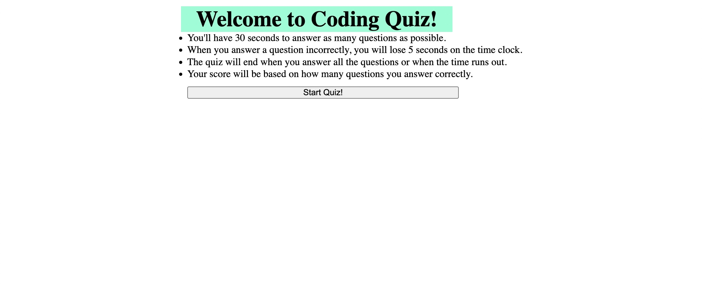

# Coding Quiz

## Languages
* HTML
* CSS
* Javascript

## Purpose
Create a timed quiz that keeps track of score per question answered correctly and store a score when finished.

## Link
https://codyeddie.github.io/coding-quiz/

## Contributions 
Made by Cody Eddie